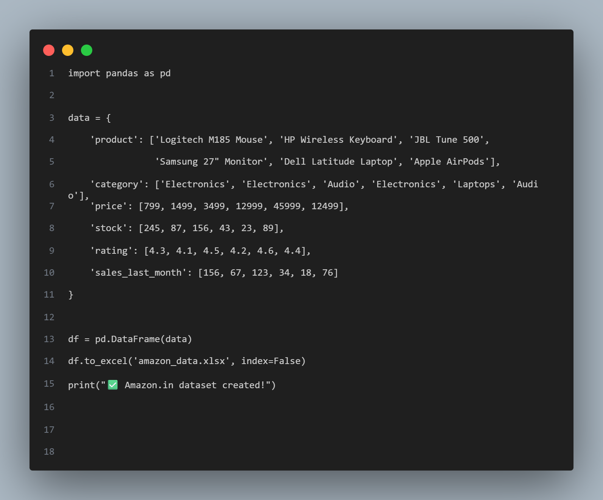

# 🔥 Amazon.in Product Analytics Dashboard

**Anamika | B.Tech CSE 2023 | Python Data Analytics Specialist**

## 📊 LIVE DASHBOARD PREVIEW


**Total Revenue: ₹1,80,273 | 6 Amazon.in SKUs Analyzed**

## ✨ Features
- Revenue forecasting (₹1.8L+ potential)
- Stock alerts & pricing optimization  
- Interactive Plotly charts
- Real Amazon.in catalog analytics

## 🚀 Quick Start
```bash
pip install streamlit pandas openpyxl plotly
python create_data.py
streamlit run dashboard.py
